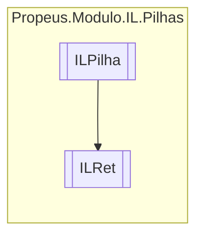

# ILRet `class`

## Description
Cria uma instrução IL de retorno

## Diagram


## Members
### Methods
#### Public  methods
| Returns | Name |
| --- | --- |
| `void` | [`Executar`](#executar)() |
| `string` | [`ToString`](#tostring)() |

## Details
### Summary
Cria uma instrução IL de retorno

### Inheritance
 - [
`ILPilha`
](./ILPilha.md)

### Constructors
#### ILRet
[*Source code*](https://github.com///blob//src/Propeus.Modulo.Dinamico/Properties/Resources.Designer.cs#L211)
```csharp
public ILRet(ILBuilderProxy proxy)
```
##### Arguments
| Type | Name | Description |
| --- | --- | --- |
| [`ILBuilderProxy`](../proxy/ILBuilderProxy.md) | proxy |   |

### Methods
#### Executar
[*Source code*](https://github.com///blob//src/Propeus.Modulo.Abstrato/Util/Reflections/Helper.cs#L69)
```csharp
public override void Executar()
```

#### ToString
[*Source code*](https://github.com///blob//src/Propeus.Modulo.Abstrato/Util/Reflections/Helper.cs#L82)
```csharp
public override string ToString()
```

*Generated with* [*ModularDoc*](https://github.com/hailstorm75/ModularDoc)
