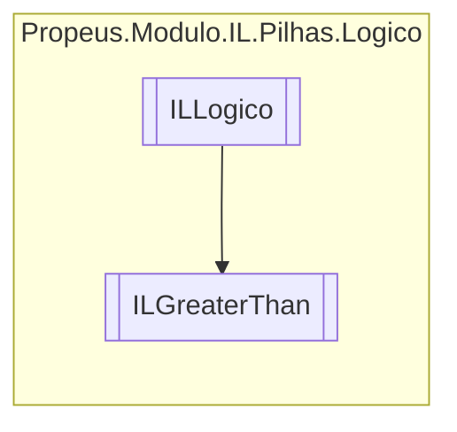

# ILGreaterThan `class`

## Description
&gt; || OpCodes.Ble_Un_S || OpCodes.Cgt

## Diagram


## Details
### Summary
&gt; || OpCodes.Ble_Un_S || OpCodes.Cgt

### Inheritance
 - [
`ILLogico`
](./ILLogico.md)

### Constructors
#### ILGreaterThan [1/2]
[*Source code*](https://github.com///blob//src/Propeus.Modulo.Abstrato/Util/Tabelas/Helper.cs#L16707566)
```csharp
public ILGreaterThan(ILBuilderProxy iLBuilderProxy)
```
##### Arguments
| Type | Name | Description |
| --- | --- | --- |
| [`ILBuilderProxy`](../../proxy/ILBuilderProxy.md) | iLBuilderProxy |   |

#### ILGreaterThan [2/2]
[*Source code*](https://github.com///blob//src/Propeus.Modulo.Abstrato/Util/Tabelas/Helper.cs#L150)
```csharp
public ILGreaterThan(ILBuilderProxy iLBuilderProxy, ILLabel label)
```
##### Arguments
| Type | Name | Description |
| --- | --- | --- |
| [`ILBuilderProxy`](../../proxy/ILBuilderProxy.md) | iLBuilderProxy |   |
| [`ILLabel`](../saltos/ILLabel.md) | label |   |

*Generated with* [*ModularDoc*](https://github.com/hailstorm75/ModularDoc)
