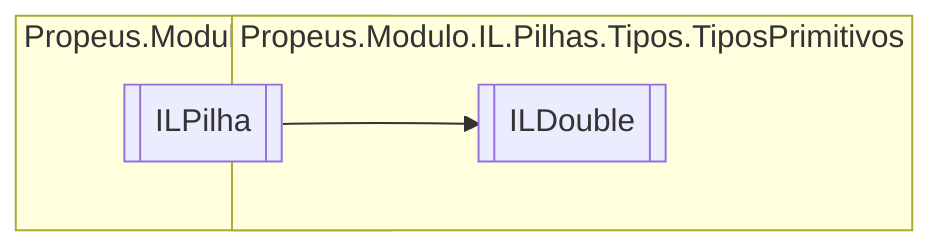

# ILDouble `class`

## Description
Double || float64 || OpCodes.Ldc_R8

## Diagram


## Members
### Properties
#### Public  properties
| Type | Name | Methods |
| --- | --- | --- |
| `double` | [`Valor`](#valor) | `get` |

### Methods
#### Public  methods
| Returns | Name |
| --- | --- |
| `void` | [`Executar`](#executar)() |
| `string` | [`ToString`](#tostring)() |

## Details
### Summary
Double || float64 || OpCodes.Ldc_R8

### Inheritance
 - [
`ILPilha`
](../../ILPilha.md)

### Constructors
#### ILDouble
[*Source code*](https://github.com///blob//src/Propeus.Modulo.Dinamico/Regras/ModuloAutoInicializavelRegra.cs#L19)
```csharp
public ILDouble(ILBuilderProxy proxy, double valor)
```
##### Arguments
| Type | Name | Description |
| --- | --- | --- |
| [`ILBuilderProxy`](../../../proxy/ILBuilderProxy.md) | proxy |   |
| `double` | valor |   |

##### Summary
Double || float64 || OpCodes.Ldc_R8

### Methods
#### Executar
[*Source code*](https://github.com///blob//src/Propeus.Modulo.Abstrato/Util/Tipos/Helper.cs#L247)
```csharp
public override void Executar()
```

#### ToString
[*Source code*](https://github.com///blob//src/Propeus.Modulo.Dinamico/Regras/ModuloComAtributoRegra.cs#L16)
```csharp
public override string ToString()
```

### Properties
#### Valor
```csharp
public double Valor { get; }
```

*Generated with* [*ModularDoc*](https://github.com/hailstorm75/ModularDoc)
