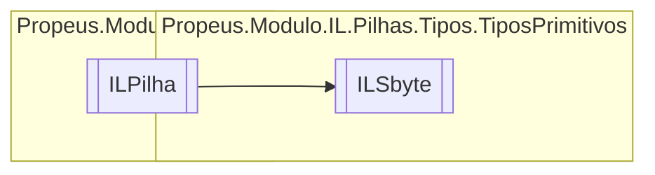

# ILSbyte `class`

## Description
SByte || int8 || OpCodes.Ldc_I4_S

## Diagram


## Members
### Properties
#### Public  properties
| Type | Name | Methods |
| --- | --- | --- |
| `sbyte` | [`Valor`](#valor) | `get` |

### Methods
#### Public  methods
| Returns | Name |
| --- | --- |
| `void` | [`Executar`](#executar)() |
| `string` | [`ToString`](#tostring)() |

## Details
### Summary
SByte || int8 || OpCodes.Ldc_I4_S

### Inheritance
 - [
`ILPilha`
](../../ILPilha.md)

### Constructors
#### ILSbyte
[*Source code*](https://github.com///blob//src/Propeus.Modulo.Abstrato/Util/Thread/LimitedConcurrencyLevelTaskScheduler.cs#L139)
```csharp
public ILSbyte(ILBuilderProxy proxy, sbyte valor)
```
##### Arguments
| Type | Name | Description |
| --- | --- | --- |
| [`ILBuilderProxy`](../../../proxy/ILBuilderProxy.md) | proxy |   |
| `sbyte` | valor |   |

##### Summary
SByte || int8 || OpCodes.Ldc_I4_S

### Methods
#### Executar
[*Source code*](https://github.com///blob//src/Propeus.Modulo.Abstrato/Util/Thread/LimitedConcurrencyLevelTaskScheduler.cs#L63)
```csharp
public override void Executar()
```

#### ToString
[*Source code*](https://github.com///blob//src/Propeus.Modulo.Abstrato/Util/Thread/TaskJob.cs#L21)
```csharp
public override string ToString()
```

### Properties
#### Valor
```csharp
public sbyte Valor { get; }
```

*Generated with* [*ModularDoc*](https://github.com/hailstorm75/ModularDoc)
