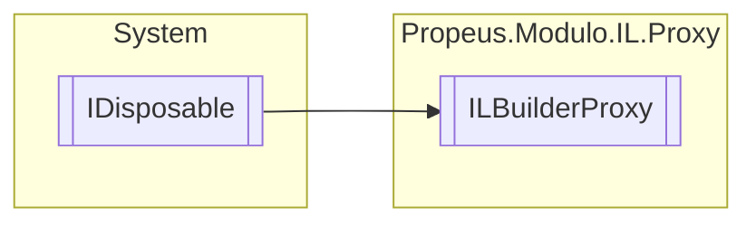

# ILBuilderProxy `class`

## Description
Abstração de PropertyBuilder , MethodBuilder , FieldBuilder , EventBuilder em um unico objeto

## Diagram


## Members
### Properties
#### Internal  properties
| Type | Name | Methods |
| --- | --- | --- |
| `ILGenerator` | [`ILGenerator`](#ilgenerator) | `get` |

### Methods
#### Public  methods
| Returns | Name |
| --- | --- |
| `void` | [`AtualizarBuilder`](#atualizarbuilder)(`object` builder) |
| [`ILBuilderProxy`](propeus/modulo/il/proxy/ILBuilderProxy.md) | [`Clone`](#clone)(`bool` stack)<br>Cria uma nova instancia da classe passando somente o AssemblyBuilder e ModuleBuilder |
| `void` | [`Dispose`](#dispose-22)() |
| `TBuilder` | [`ObterBuilder`](#obterbuilder)() |
| `void` | [`RegistrarBuilders`](#registrarbuilders)(`object``[]` builders)<br>Adiciona um novo builder no proxy |
| `void` | [`RegistrarOuAtualizarBuilder`](#registrarouatualizarbuilder)(`object` builder) |
| `string` | [`ToString`](#tostring)()<br>Exibe a pilha de execução do IL |

#### Internal  methods
| Returns | Name |
| --- | --- |
| `LocalBuilder` | [`DeclareLocal`](#declarelocal)(`Type` tipo) |
| `FieldBuilder` | [`DefineField`](#definefield)(`string` fieldName, `Type` type, `FieldAttributes` attributes) |
| `Label` | [`DefineLabel`](#definelabel)() |
| `void` | [`DefinirGeneratorPadrao`](#definirgeneratorpadrao)(`object` builder) |
| `void` | [`Emit`](#emit-112)(`...`) |
| `void` | [`MarkLabel`](#marklabel)(`Label` jump) |

#### Protected  methods
| Returns | Name |
| --- | --- |
| `void` | [`Dispose`](#dispose-12)(`bool` disposing) |

#### Public Static methods
| Returns | Name |
| --- | --- |
| [`ILBuilderProxy`](propeus/modulo/il/proxy/ILBuilderProxy.md) | `implicit` `operator` [`ILBuilderProxy`](#operator-ilbuilderproxy-12)(`...`) |
| [`ILBuilderProxy`](propeus/modulo/il/proxy/ILBuilderProxy.md) | [`ToILBuilderProxy`](#toilbuilderproxy-12)(`...`) |

## Details
### Summary
Abstração de PropertyBuilder , MethodBuilder , FieldBuilder , EventBuilder em um unico objeto

### Inheritance
 - `IDisposable`

### Constructors
#### ILBuilderProxy [1/9]
[*Source code*](https://github.com///blob//src/Propeus.Modulo.IL/Proxy/ILBuilderProxy.cs#L114)
```csharp
public ILBuilderProxy()
```
##### Summary
Construtor simples

#### ILBuilderProxy [2/9]
[*Source code*](https://github.com///blob//src/Propeus.Modulo.IL/Proxy/ILBuilderProxy.cs#L35)
```csharp
public ILBuilderProxy(object[] builders)
```
##### Arguments
| Type | Name | Description |
| --- | --- | --- |
| `object``[]` | builders |   |

#### ILBuilderProxy [3/9]
[*Source code*](https://github.com///blob//src/Propeus.Modulo.Dinamico/Gerenciador.cs#L95)
```csharp
public ILBuilderProxy(PropertyBuilder builder)
```
##### Arguments
| Type | Name | Description |
| --- | --- | --- |
| `PropertyBuilder` | builder |  |

##### Summary
Instncia a [ILBuilderProxy](propeus/modulo/il/proxy/ILBuilderProxy.md) adicionando o PropertyBuilder

#### ILBuilderProxy [4/9]
[*Source code*](https://github.com///blob//src/Propeus.Modulo.Dinamico/Gerenciador.cs#L91)
```csharp
public ILBuilderProxy(MethodBuilder builder)
```
##### Arguments
| Type | Name | Description |
| --- | --- | --- |
| `MethodBuilder` | builder |  |

##### Summary
Instncia a [ILBuilderProxy](propeus/modulo/il/proxy/ILBuilderProxy.md) adicionando o MethodBuilder

#### ILBuilderProxy [5/9]
[*Source code*](https://github.com///blob//src/Propeus.Modulo.Dinamico/Gerenciador.cs#L95)
```csharp
public ILBuilderProxy(FieldBuilder builder)
```
##### Arguments
| Type | Name | Description |
| --- | --- | --- |
| `FieldBuilder` | builder |  |

##### Summary
Instncia a [ILBuilderProxy](propeus/modulo/il/proxy/ILBuilderProxy.md) adicionando o FieldBuilder

#### ILBuilderProxy [6/9]
[*Source code*](https://github.com///blob//src/Propeus.Modulo.Dinamico/Gerenciador.cs#L95)
```csharp
public ILBuilderProxy(EventBuilder builder)
```
##### Arguments
| Type | Name | Description |
| --- | --- | --- |
| `EventBuilder` | builder |  |

##### Summary
Instncia a [ILBuilderProxy](propeus/modulo/il/proxy/ILBuilderProxy.md) adicionando o EventBuilder

#### ILBuilderProxy [7/9]
[*Source code*](https://github.com///blob//src/Propeus.Modulo.Dinamico/Gerenciador.cs#L96)
```csharp
public ILBuilderProxy(ConstructorBuilder builder)
```
##### Arguments
| Type | Name | Description |
| --- | --- | --- |
| `ConstructorBuilder` | builder |  |

##### Summary
Instncia a [ILBuilderProxy](propeus/modulo/il/proxy/ILBuilderProxy.md) adicionando o ConstructorBuilder

#### ILBuilderProxy [8/9]
[*Source code*](https://github.com///blob//src/Propeus.Modulo.Dinamico/Gerenciador.cs#L98)
```csharp
public ILBuilderProxy(TypeBuilder builder)
```
##### Arguments
| Type | Name | Description |
| --- | --- | --- |
| `TypeBuilder` | builder |  |

##### Summary
Instncia a [ILBuilderProxy](propeus/modulo/il/proxy/ILBuilderProxy.md) adicionando o TypeBuilder

#### ILBuilderProxy [9/9]
[*Source code*](https://github.com///blob//src/Propeus.Modulo.Dinamico/Gerenciador.cs#L99)
```csharp
public ILBuilderProxy(AssemblyBuilder builder)
```
##### Arguments
| Type | Name | Description |
| --- | --- | --- |
| `AssemblyBuilder` | builder |  |

##### Summary
Instncia a [ILBuilderProxy](propeus/modulo/il/proxy/ILBuilderProxy.md) adicionando o AssemblyBuilder

### Methods
#### ObterBuilder
[*Source code*](https://github.com///blob//src/Propeus.Modulo.Dinamico/Gerenciador.cs#L104)
```csharp
public TBuilder ObterBuilder<TBuilder>()
where TBuilder : 
```

#### RegistrarOuAtualizarBuilder
[*Source code*](https://github.com///blob//src/Propeus.Modulo.Dinamico/Gerenciador.cs#L104)
```csharp
public void RegistrarOuAtualizarBuilder(object builder)
```
##### Arguments
| Type | Name | Description |
| --- | --- | --- |
| `object` | builder |   |

#### AtualizarBuilder
[*Source code*](https://github.com///blob//src/Propeus.Modulo.Dinamico/Gerenciador.cs#L108)
```csharp
public void AtualizarBuilder(object builder)
```
##### Arguments
| Type | Name | Description |
| --- | --- | --- |
| `object` | builder |   |

#### RegistrarBuilders
[*Source code*](https://github.com///blob//src/Propeus.Modulo.Dinamico/Gerenciador.cs#L16707566)
```csharp
public void RegistrarBuilders(object[] builders)
```
##### Arguments
| Type | Name | Description |
| --- | --- | --- |
| `object``[]` | builders |  |

##### Summary
Adiciona um novo builder no proxy

#### DefinirGeneratorPadrao
[*Source code*](https://github.com///blob//src/Propeus.Modulo.Dinamico/Gerenciador.cs#L118)
```csharp
internal void DefinirGeneratorPadrao(object builder)
```
##### Arguments
| Type | Name | Description |
| --- | --- | --- |
| `object` | builder |   |

#### Emit [1/12]
[*Source code*](https://github.com///blob//src/Propeus.Modulo.Dinamico/Gerenciador.cs#L178)
```csharp
internal void Emit(OpCode code, Type valor)
```
##### Arguments
| Type | Name | Description |
| --- | --- | --- |
| `OpCode` | code |   |
| `Type` | valor |   |

#### Emit [2/12]
[*Source code*](https://github.com///blob//src/Propeus.Modulo.Dinamico/Gerenciador.cs#L182)
```csharp
internal void Emit(OpCode code)
```
##### Arguments
| Type | Name | Description |
| --- | --- | --- |
| `OpCode` | code |   |

#### Emit [3/12]
[*Source code*](https://github.com///blob//src/Propeus.Modulo.Dinamico/Gerenciador.cs#L189)
```csharp
internal void Emit(OpCode code, Label jump)
```
##### Arguments
| Type | Name | Description |
| --- | --- | --- |
| `OpCode` | code |   |
| `Label` | jump |   |

#### Emit [4/12]
[*Source code*](https://github.com///blob//src/Propeus.Modulo.Dinamico/Gerenciador.cs#L195)
```csharp
internal void Emit(OpCode code, LocalBuilder variavelLocal)
```
##### Arguments
| Type | Name | Description |
| --- | --- | --- |
| `OpCode` | code |   |
| `LocalBuilder` | variavelLocal |   |

#### Emit [5/12]
[*Source code*](https://github.com///blob//src/Propeus.Modulo.Dinamico/Gerenciador.cs#L200)
```csharp
internal void Emit(OpCode code, int v)
```
##### Arguments
| Type | Name | Description |
| --- | --- | --- |
| `OpCode` | code |   |
| `int` | v |   |

#### Emit [6/12]
[*Source code*](https://github.com///blob//src/Propeus.Modulo.Dinamico/Gerenciador.cs#L213)
```csharp
internal void Emit(OpCode code, long v)
```
##### Arguments
| Type | Name | Description |
| --- | --- | --- |
| `OpCode` | code |   |
| `long` | v |   |

#### Emit [7/12]
[*Source code*](https://github.com///blob//src/Propeus.Modulo.Dinamico/Gerenciador.cs#L218)
```csharp
internal void Emit(OpCode code, float v)
```
##### Arguments
| Type | Name | Description |
| --- | --- | --- |
| `OpCode` | code |   |
| `float` | v |   |

#### Emit [8/12]
[*Source code*](https://github.com///blob//src/Propeus.Modulo.Dinamico/Gerenciador.cs#L227)
```csharp
internal void Emit(OpCode code, double v)
```
##### Arguments
| Type | Name | Description |
| --- | --- | --- |
| `OpCode` | code |   |
| `double` | v |   |

#### Emit [9/12]
[*Source code*](https://github.com///blob//src/Propeus.Modulo.Dinamico/Gerenciador.cs#L233)
```csharp
internal void Emit(OpCode code, ConstructorInfo ctor)
```
##### Arguments
| Type | Name | Description |
| --- | --- | --- |
| `OpCode` | code |   |
| `ConstructorInfo` | ctor |   |

#### Emit [10/12]
[*Source code*](https://github.com///blob//src/Propeus.Modulo.Dinamico/Gerenciador.cs#L242)
```csharp
internal void Emit(OpCode code, MethodInfo mth)
```
##### Arguments
| Type | Name | Description |
| --- | --- | --- |
| `OpCode` | code |   |
| `MethodInfo` | mth |   |

#### Emit [11/12]
[*Source code*](https://github.com///blob//src/Propeus.Modulo.Dinamico/Gerenciador.cs#L246)
```csharp
internal void Emit(OpCode code, FieldBuilder fieldBuilder)
```
##### Arguments
| Type | Name | Description |
| --- | --- | --- |
| `OpCode` | code |   |
| `FieldBuilder` | fieldBuilder |   |

#### Emit [12/12]
[*Source code*](https://github.com///blob//src/Propeus.Modulo.Dinamico/Gerenciador.cs#L251)
```csharp
internal void Emit(OpCode code, string v)
```
##### Arguments
| Type | Name | Description |
| --- | --- | --- |
| `OpCode` | code |   |
| `string` | v |   |

#### MarkLabel
[*Source code*](https://github.com///blob//src/Propeus.Modulo.Abstrato/ModuloTipo.cs#L41)
```csharp
internal void MarkLabel(Label jump)
```
##### Arguments
| Type | Name | Description |
| --- | --- | --- |
| `Label` | jump |   |

#### DefineLabel
[*Source code*](https://github.com///blob//src/Propeus.Modulo.Dinamico/Gerenciador.cs#L262)
```csharp
internal Label DefineLabel()
```

#### DeclareLocal
[*Source code*](https://github.com///blob//src/Propeus.Modulo.Dinamico/Gerenciador.cs#L268)
```csharp
internal LocalBuilder DeclareLocal(Type tipo)
```
##### Arguments
| Type | Name | Description |
| --- | --- | --- |
| `Type` | tipo |   |

#### DefineField
[*Source code*](https://github.com///blob//src/Propeus.Modulo.Dinamico/Gerenciador.cs#L33)
```csharp
internal FieldBuilder DefineField(string fieldName, Type type, FieldAttributes attributes)
```
##### Arguments
| Type | Name | Description |
| --- | --- | --- |
| `string` | fieldName |   |
| `Type` | type |   |
| `FieldAttributes` | attributes |   |

#### Clone
[*Source code*](https://github.com///blob//src/Propeus.Modulo.Dinamico/Gerenciador.cs#L62)
```csharp
public ILBuilderProxy Clone(bool stack)
```
##### Arguments
| Type | Name | Description |
| --- | --- | --- |
| `bool` | stack |   |

##### Summary
Cria uma nova instancia da classe passando somente o AssemblyBuilder e ModuleBuilder

##### Returns


#### ToString
[*Source code*](https://github.com///blob//src/Propeus.Modulo.Dinamico/ModuloAssemblyLoadContext.cs#L13)
```csharp
public override string ToString()
```
##### Summary
Exibe a pilha de execução do IL

##### Returns


#### Dispose [1/2]
[*Source code*](https://github.com///blob//src/Propeus.Modulo.Dinamico/ModuloBinario.cs#L22)
```csharp
protected virtual void Dispose(bool disposing)
```
##### Arguments
| Type | Name | Description |
| --- | --- | --- |
| `bool` | disposing |   |

#### Dispose [2/2]
[*Source code*](https://github.com///blob//src/Propeus.Modulo.Dinamico/ModuloBinario.cs#L46)
```csharp
public virtual void Dispose()
```

#### Operator ILBuilderProxy [1/2]
[*Source code*](https://github.com///blob//src/Propeus.Modulo.Dinamico/ModuloBinario.cs#L51)
```csharp
public static implicit operator ILBuilderProxy(MethodBuilder methodBuilder)
```
##### Arguments
| Type | Name | Description |
| --- | --- | --- |
| `MethodBuilder` | methodBuilder |   |

#### Operator ILBuilderProxy [2/2]
[*Source code*](https://github.com///blob//src/Propeus.Modulo.Dinamico/ModuloBinario.cs#L56)
```csharp
public static implicit operator ILBuilderProxy(ConstructorBuilder constructorBuilder)
```
##### Arguments
| Type | Name | Description |
| --- | --- | --- |
| `ConstructorBuilder` | constructorBuilder |   |

#### ToILBuilderProxy [1/2]
[*Source code*](https://github.com///blob//src/Propeus.Modulo.Dinamico/ModuloBinario.cs#L61)
```csharp
public static ILBuilderProxy ToILBuilderProxy(ConstructorBuilder methodBuilder)
```
##### Arguments
| Type | Name | Description |
| --- | --- | --- |
| `ConstructorBuilder` | methodBuilder |   |

#### ToILBuilderProxy [2/2]
[*Source code*](https://github.com///blob//src/Propeus.Modulo.Dinamico/ModuloBinario.cs#L66)
```csharp
public static ILBuilderProxy ToILBuilderProxy(MethodBuilder methodBuilder)
```
##### Arguments
| Type | Name | Description |
| --- | --- | --- |
| `MethodBuilder` | methodBuilder |   |

### Properties
#### ILGenerator
```csharp
internal ILGenerator ILGenerator { get; }
```

*Generated with* [*ModularDoc*](https://github.com/hailstorm75/ModularDoc)
